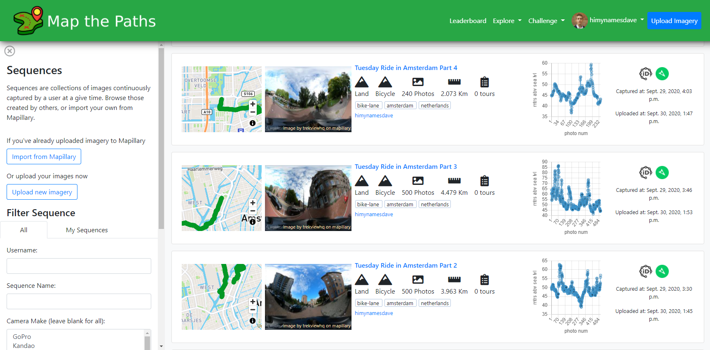

# Map the Paths

## About

Map the Paths is a web application that allows you to share your street-level map imagery.

https://mtp.trekview.org

## Features



* Import images from Mapillary or upload directly using [the desktop uploader](https://mtp.trekview.org).
* Photos: Photos are street-level images that belong to a Sequence
* Sequences: Sequences are collections of images continuously captured by a user at a give time. Browse those created by others, or import your own from Mapillary.
* Tours: Tours are collections of sequences that have been curated by their owner. Browse others' tours or create one using your own sequences.
* Guidebooks: Create a guidebook of street-level photos to show people around a location. View others people have created to help plan your next adventure.
* Challenges: Help make better maps by contributing to challenges with specific requests for imagery.
* Leaderboards: See who is topping the leaderboards for Sequences imported and Viewpoints -- both all time and challenge specific -- to see where you place in the rankings.
* Hire: Find paid help for image collection projects to create fresh street level map data in locations where it's needed for Google Street View, Mapillary, and more...
* API: Integrate your own app with Map the Paths...

## User guide

Need some help getting started? [Go here](https://guides.trekview.org/mtp-web/overview).

## Support

Having problems? [Ask a question around the Campfire (our community forum)](https://campfire.trekview.org/c/support/8).

## Developers

[See the documentation that we've written to help developers understand the logic and function of the Map the Paths](https://guides.trekview.org/mtp-web/developer-docs).

## License

[GNU Affero General Public License v3.0](/LICENSE.txt).


### Deploy on Ubuntu Server.
#### 1. [Download App](https://github.com/trek-view/mtp-web.git).
* git clone https://github.com/trek-view/mtp-web.git


#### 2. [Insall PostgreSQL].(https://www.digitalocean.com/community/tutorials/how-to-install-and-use-postgresql-on-ubuntu-20-04).

```
sudo apt install postgresql postgresql-contrib;

sudo -i -u postgres;

psql;

ALTER USER postgres PASSWORD 'myPassword';

exit;

sudo apt install postgis postgresql-12-postgis-3
```

#### 3. Install Python Packages
```
sudo -H pip3 install virtualenv

virtualenv venv

source venv/bin/activate

pip install -r requirements.txt
```

and change .env file for database connection and others.
```
DATABASE_NAME = 'postgres'
DATABASE_USER = 'postgres'
DATABASE_PASSWORD = 'password'
DATABASE_HOST = 'localhost'
```

and install database tables.
```commandline
python manage.py migrate
```

and create super admin.
```commandline
python manage.py createsuperuser
```

and exit venv.
```commandline
deactivate
```

#### 4. Install Nginx, SSL and Run Service

##### Install Nginx
```commandline
apt-get update
apt-get install nginx -y
systemctl enable nginx
systemctl start nginx
```

create nginx config file.
```commandline
sudo nano /etc/nginx/sites-enabled/myproject.conf
```
fill the file following contents.
```
server {
    server_name $YOUR_DOMAIN_NAME www.YOUR_DOMAIN_NAME;

    location = /favicon.ico { access_log off; log_not_found off; }
    location /static/ {
        root /home/wang/mpt-web;
    }

    location / {
        include proxy_params;
        proxy_pass http://127.0.0.1:8000/;
    }
}
```

##### Install Encrypt SSL
```commandline
snap install core 
sudo snap refresh core
snap install --classic certbot
ln -s /snap/bin/certbot /usr/bin/certbot
certbot --nginx

certbot --nginx  --agree-tos --register-unsafely-without-email -d $YOUR_DOMAIN_NAME www.$YOUR_DOMAIN_NAME
```

##### Create Python Service File
```commandline
sudo nano /etc/systemd/system/python.service
```

fill the file following content.
```
[Unit]
Description=Python daemon
After=network.target

[Service]
User=root
Group=root
WorkingDirectory=$APP_ROOT_PATH
ExecStart=$APP_ROOT_PATH/venv/bin/python3 $APP_ROOT_PATH/manage.py runserver

[Install]
WantedBy=multi-user.target
```

#### Run MTPW APP
```commandline
systemctl daemon-reload
systemctl start python.service
systemctl enable python.service
```

Check MTPW Service
```commandline
systemctl status python.service
```

Stop MTPW Service
```commandline
systemctl stop python.service
```

Restart MTPW Service
```commandline
systemctl restart python.service
```

#### * Install Nginx, SSL and Run Service (Quick Run)
```commandline
chmod +x nginx+SSL+python.txt

./nginx+SSL+python.txt
```
